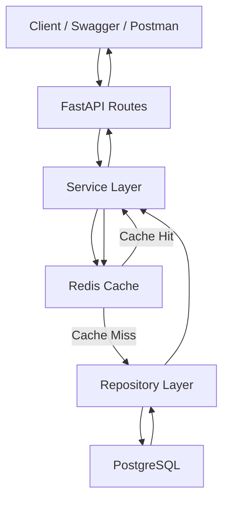
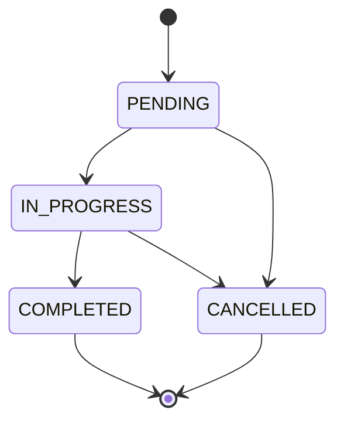
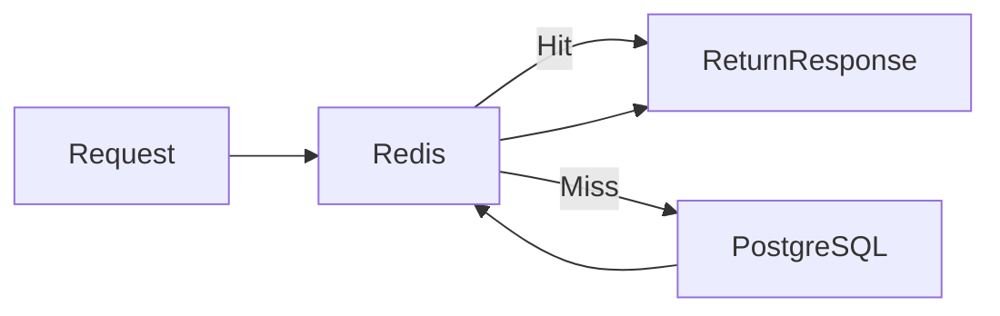

# Task Management API
Built using:

- FastAPI
- PostgreSQL
- SQLAlchemy
- Redis
 

# Features Implemented

## Core Features

- User CRUD APIs
- Task CRUD APIs
- Task Assignment
- Query Filtering
- Pagination
- Task Status State Machine
- Redis Caching
- Cache Invalidation
- Structured Logging
- PostgreSQL Integration

 

# Project Architecture

This project follows:

```text
Route Layer
    ↓
Service Layer
    ↓
Repository Layer
    ↓
Database / Cache
```

---

# API Request Flow



---

# Layer Responsibilities

| Layer | Responsibility |
|---|---|
| Routes | Handles API requests/responses |
| Service Layer | Business logic |
| Repository Layer | Database queries |
| Database | Persistent storage |
| Redis | Fast cache storage |


# Local Setup Guide

# 1. Clone Repository

```bash
git clone <repo-url>

cd task-management-api
```

---

# 2. Create Virtual Environment

```bash
python -m venv venv
```

Activate:

## Windows

```bash
venv\Scripts\activate
```


# 3. Install Dependencies

```bash
pip install -r requirements.txt
```

---

# 4. PostgreSQL Setup

## Create Database

Open pgAdmin or psql:

```sql
CREATE DATABASE task_db;
```

---

# 5. Redis Setup

Run latest Redis container:

```bash
docker run -d \
  --name redis-container \
  -p 6379:6379 \
  redis:7
```

Verify:

```bash
docker ps
```

---

# 6. Environment Variables

We are pushing `.env` file in repository for easier reviewer setup.

Reviewer can directly run project without creating environment variables manually.

Example `.env`
 
# 7. Run FastAPI Server

```bash
uvicorn app.main:app --reload
```

---

# 8. Open Swagger Docs

```text
http://127.0.0.1:8000/docs
```

---

# Database Design

# Users Table

| Column | Type |
|---|---|
| id | Integer |
| username | String |
| email | String |
| is_active | Boolean |
| created_at | Timestamp |

---

# Tasks Table

| Column | Type |
|---|---|
| id | Integer |
| title | String |
| description | String |
| status | Enum |
| created_by | Foreign Key |
| assigned_to | Foreign Key |
| created_at | Timestamp |
| updated_at | Timestamp |

---

# Task Status State Machine



---

# Allowed Task Transitions

| Current Status | Allowed Next Status |
|---|---|
| PENDING | IN_PROGRESS, CANCELLED |
| IN_PROGRESS | COMPLETED, CANCELLED |
| COMPLETED | None |
| CANCELLED | None |

---

# Redis Caching

Caching implemented for:

| API | Cache Key |
|---|---|
| Get Task By ID | `task:{task_id}` |
| Get Tasks By User | `tasks:user:{user_id}` |

---

# Cache TTL

```text
300 seconds
```

---

# Cache Flow



---

# Cache Features

- Cache Hit Logging
- Cache Miss Logging
- Automatic Cache Invalidation
- Graceful DB Fallback if Redis Fails

---

# API Endpoints

# User APIs

---

## Create User

### Endpoint

```http
POST /users
```

### Request Body

```json
{
  "username": "john",
  "email": "john@example.com"
}
```

---

## Get User By ID

### Endpoint

```http
GET /users/{user_id}
```

---

## List Users

### Endpoint

```http
GET /users
```

---

# Task APIs

---

## Create Task

### Endpoint

```http
POST /tasks
```

### Request Body

```json
{
  "title": "Learn FastAPI",
  "description": "Study FastAPI deeply",
  "created_by": 1
}
```

---

## Get Task By ID

### Endpoint

```http
GET /tasks/{task_id}
```

### Features

- Redis Cached
- DB Fallback

---

## Get Tasks By User

### Endpoint

```http
GET /tasks/user/{user_id}
```

### Features

- Redis Cached
- DB Fallback

---

## Update Task

### Endpoint

```http
PUT /tasks/{task_id}
```

### Request Body

```json
{
  "title": "Updated Task",
  "status": "IN_PROGRESS"
}
```

---

## Assign Task

### Endpoint

```http
PUT /tasks/{task_id}/assign
```

### Request Body

```json
{
  "assigned_to": 2
}
```


## Delete Task

### Endpoint

```http
DELETE /tasks/{task_id}
```
 


 Date:25/05/2026
 Work Item: https://app.plane.so/predusk/browse/DIGILEKH-33/
 Github Link: https://github.com/aaryan-pv/task_management