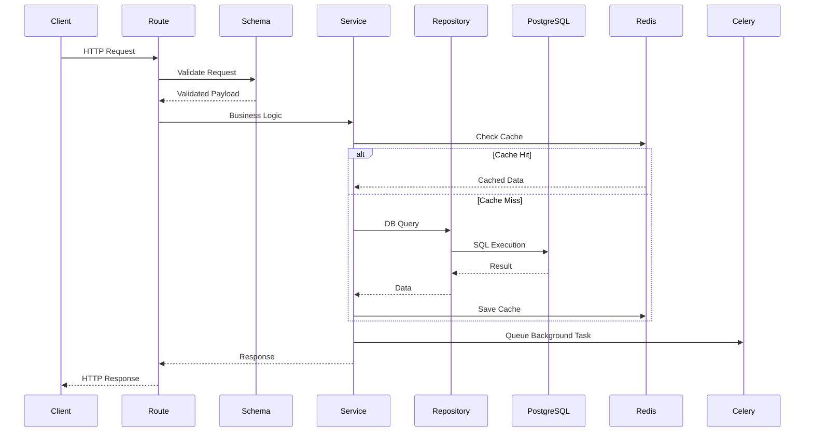

# API Routes Documentation

This document explains all API routes, their purpose, request flow and validation behavior.

---

# API Request Flow



---

# User Routes

---

## Create User

```http
POST /users/
```

### Purpose

Creates a new user.

---

## Get User

```http
GET /users/{id}
```

### Purpose

Fetch single user by ID.

---

## List Users

```http
GET /users/
```

### Purpose

Returns all users.

---

## Update User

```http
PUT /users/{id}
```

### Purpose

Updates user data.

---

## Delete User

```http
DELETE /users/{id}
```

### Purpose

Deletes user.

---

# Task Routes

---

## Create Task

```http
POST /tasks/
```

### Features

- Create task
- Assign user
- Validation
- Cache invalidation

---

## Get Task

```http
GET /tasks/{id}
```

### Features

- Redis caching
- DB fallback
- Cache population

---

## Get Tasks By User

```http
GET /tasks/user/{user_id}
```

### Features

- Redis caching
- Query filtering

---

## Query Tasks

```http
GET /tasks/
```

### Query Params

| Param | Purpose |
|---|---|
| status | filter by status |
| page | pagination |
| limit | page size |
| sort_by | sorting |

---

## Update Task

```http
PUT /tasks/{id}
```

### Features

- State machine validation
- Optimistic locking
- Assignment validation
- Celery queue trigger
- Cache invalidation

---

## Delete Task

```http
DELETE /tasks/{id}
```

### Features

- Deletes task
- Invalidates cache

---

# Bulk Routes

---

## Bulk Create Tasks

```http
POST /tasks/bulk
```

### Features

- Multiple task creation
- Partial failure handling
- Validation per item

---

## Bulk Update Status

```http
PUT /tasks/bulk/status
```

### Features

- Multiple task updates
- Concurrency-safe updates
- Validation per task

---

# Validation Layers

| Layer | Purpose |
|---|---|
| Pydantic | Request validation |
| Service Layer | Business validation |
| PostgreSQL | Constraint validation |

---

# State Machine Rules

| Current | Allowed Next |
|---|---|
| pending | in_progress, cancelled |
| in_progress | completed, cancelled |
| completed | none |
| cancelled | none |