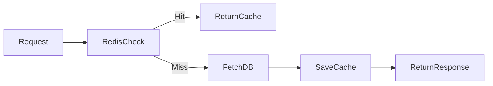

# Redis Cache Flow

---

# Cache Architecture



---

# Cache Keys

| Key | Purpose |
|---|---|
| task:{id} | Single task |
| tasks:user:{id} | User tasks |

---

# TTL

```text
300 seconds
```

---

# Cache Hit

Redis returns data immediately.

No DB query executed.

---

# Cache Miss

Flow:
1. fetch from PostgreSQL
2. save to Redis
3. return response

---

# Cache Invalidation

Triggered on:
- create
- update
- delete

---

# Why Important

Benefits:
- reduced DB load
- faster APIs
- scalable reads
- better performance