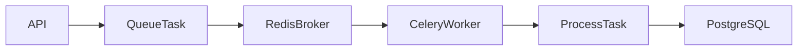
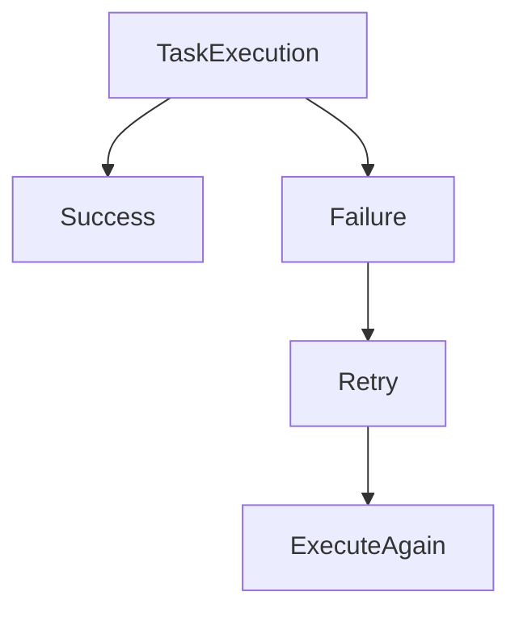

# Celery Background Worker Flow

---

# Celery Architecture



---

# Current Worker

```python
process_task_completion()
```

---

# Trigger Condition

Triggered when:

```text
task status -> completed
```

---

# Flow

1. API updates task status
2. Service layer checks status
3. Celery task queued
4. Redis stores task message
5. Worker consumes task
6. Worker processes task
7. Worker updates DB

---

# Features

- async execution
- retries
- exponential backoff
- idempotency
- structured logging

---

# Idempotency Logic

Worker checks:

```python
if task.completion_processed:
    return
```

Prevents duplicate processing.

---

# Retry Flow

