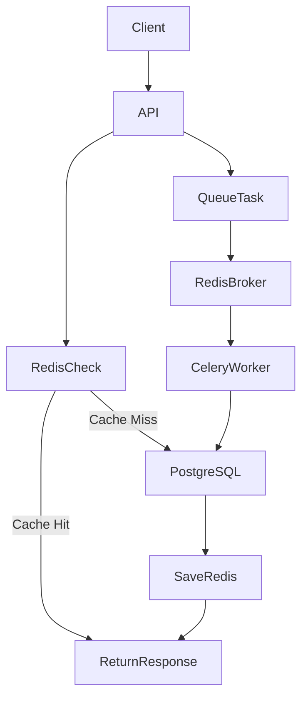
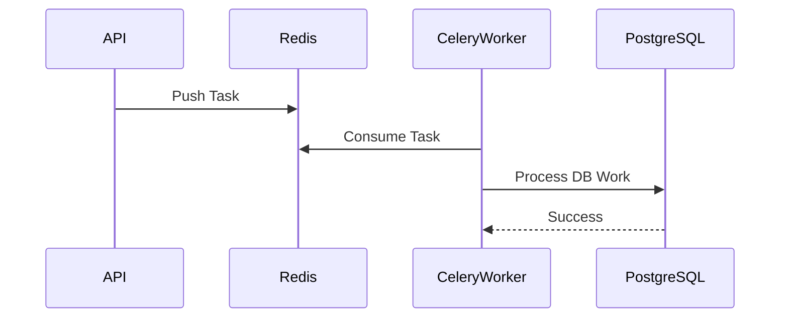
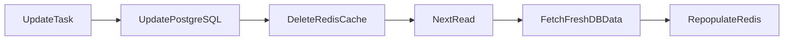

# Database Interaction Flow

This document explains how PostgreSQL, Redis and Celery interact together.

---

# Complete Interaction Flow



---

# PostgreSQL Responsibilities

PostgreSQL is the source of truth.

Stores:
- users
- tasks
- assignments
- task states

---

# Redis Responsibilities

Redis used for:

---

## 1. Caching

Stores:
- task details
- user task lists

### Cache Keys

```text
task:{task_id}

tasks:user:{user_id}
```

### TTL

```text
300 seconds
```

---

## 2. Celery Broker

Redis also acts as:

```text
message queue
```

Stores celery tasks until worker consumes them.

---

# Celery Responsibilities

Celery handles:
- async processing
- retries
- idempotent execution

---

# Celery Task Flow



---

# Cache Invalidation Flow



---

# Graceful Fallback

If Redis fails:

```text
API automatically falls back to PostgreSQL
```

This prevents API downtime.

---

# Why This Architecture

Benefits:
- faster reads
- scalable background jobs
- reduced DB load
- async processing
- production-grade separation