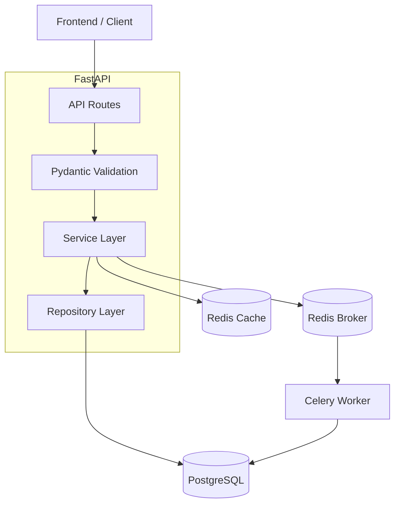
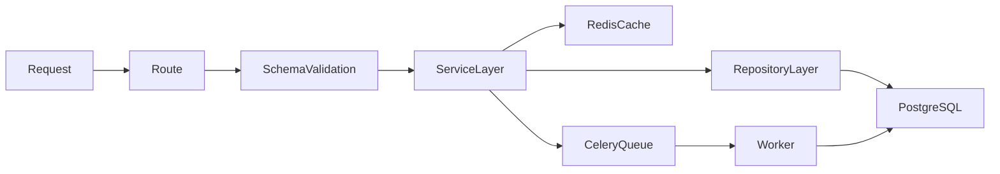

# System Architecture

This document explains the complete backend architecture and request lifecycle.

---

# High Level Architecture



---

# Architecture Layers

---

# 1. Routes Layer

### Responsibility

- Handle HTTP requests
- Parse request params
- Inject dependencies
- Call service layer

### Example

```python
@router.put("/{task_id}")
```

---

# 2. Schema Layer

### Responsibility

- Validate incoming payloads
- Enforce request structure
- Prevent invalid input

### Technology

- Pydantic

---

# 3. Service Layer

### Responsibility

Contains:
- business logic
- validation
- concurrency handling
- cache logic
- celery triggers

### Why Important

Keeps routes thin and reusable.

---

# 4. Repository Layer

### Responsibility

Contains:
- raw DB operations
- SQLAlchemy queries
- DB abstraction

### No Business Logic Here

Repositories should only interact with DB.

---

# 5. Redis Layer

### Responsibility

- caching
- celery broker
- fast reads

---

# 6. Celery Worker Layer

### Responsibility

- background processing
- retries
- async workflows
- idempotent tasks

---

# Request Lifecycle



---

# Production Features

- Layered Architecture
- Repository Pattern
- Service Pattern
- State Machine Validation
- Redis Caching
- Celery Workers
- Optimistic Locking
- Concurrency Handling
- Bulk APIs
- Structured Logging