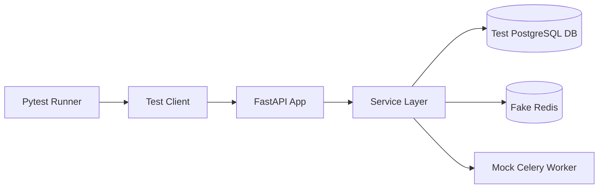
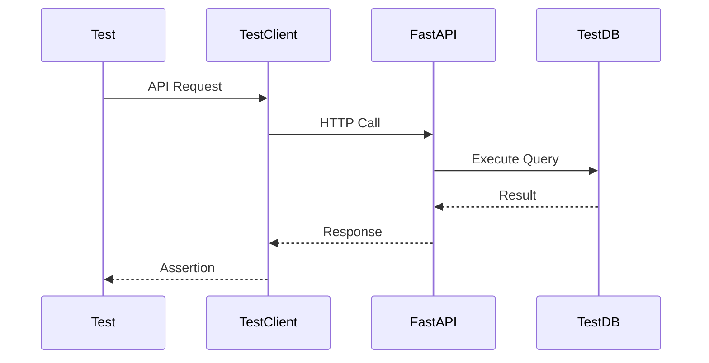
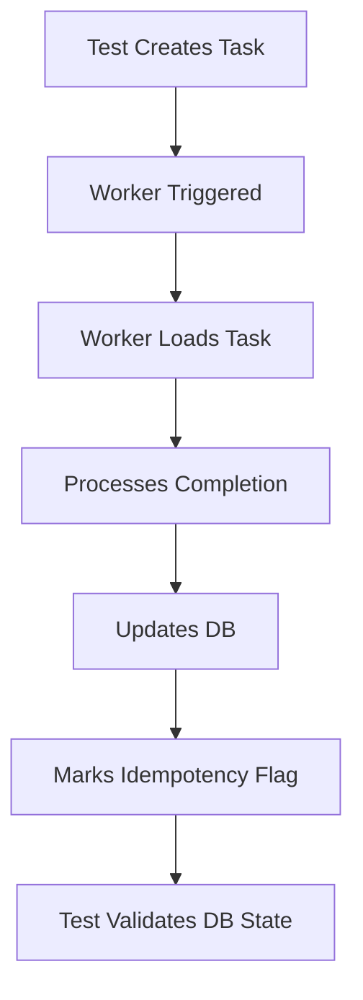
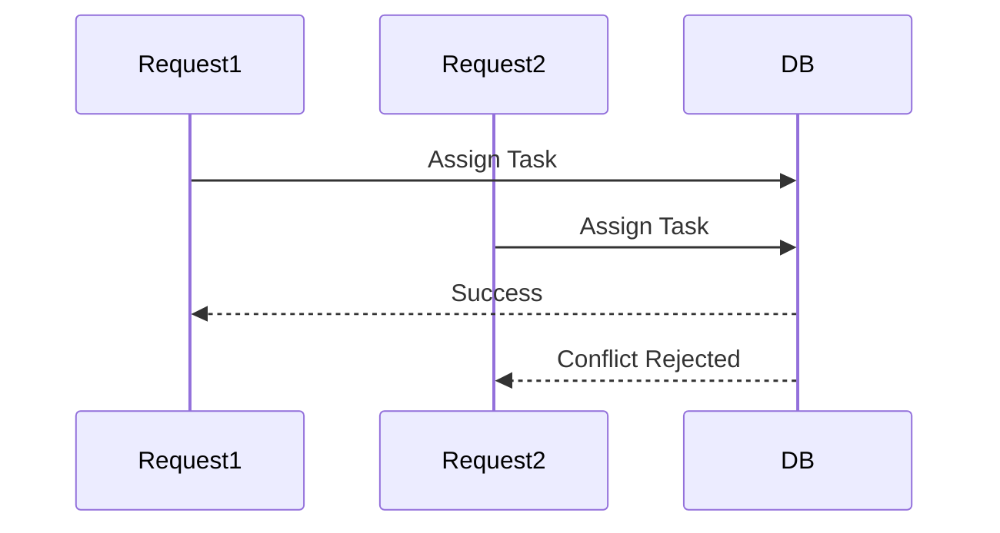

# Task Management API — Testing Guide

---

# Overview

This document explains the complete testing architecture, testing strategy, test flow, tools used, and all integration test cases implemented in the project.

The project uses:

- Pytest
- FastAPI TestClient
- SQLAlchemy Test Database
- Mocked Celery
- Mocked Redis
- Integration Testing
- Concurrent Execution Testing

The tests validate:

- API correctness
- Business logic
- Database interactions
- Cache behavior
- Celery worker execution
- Status transitions
- Concurrency handling
- Bulk operations
- Query APIs

---

# Testing Architecture



---

# Test Folder Structure

```text
tests/
│
├── conftest.py
│
├── integration/
│   ├── test_assignment.py
│   ├── test_bulk.py
│   ├── test_cache.py
│   ├── test_celery.py
│   ├── test_query.py
│   ├── test_status.py
│
├── report.html
├── test_results.txt
```

---

# Core Testing Components

---

## `conftest.py`

Central test configuration file.

### Responsibilities

- Create test database
- Override FastAPI DB dependency
- Seed test users
- Provide reusable fixtures
- Patch Celery worker DB session
- Create API test client

---

## Database Testing Flow



---

# Celery Worker Testing

The worker is tested without running an actual Celery broker.

We directly execute:

```python
process_task_completion.apply(args=[task.id])
```

This simulates actual worker execution synchronously.

---

# Worker Test Flow



---

# Redis Cache Testing

Redis behavior is validated using mocked cache interactions.

Covered:

- Cache hit
- Cache miss
- Cache invalidation
- Redis failure fallback

---

# Status Transition Testing

The tests validate:

| Transition | Expected |
|---|---|
| pending → in_progress | allowed |
| in_progress → completed | allowed |
| completed → pending | rejected |
| cancelled → pending | rejected |

---

# Assignment Concurrency Testing

The system prevents double assignment under concurrency.

---

## Concurrency Flow



---

# Bulk API Testing

Covered:

- Bulk create success
- Partial failure handling
- Multi-status updates
- Validation per item
- Error aggregation

---

# Query API Testing

Covered:

- Filtering
- Pagination
- Sorting
- Invalid query params

---

# File-wise Test Details

---

# `test_cache.py`

## Covers

- Task retrieval cache
- Cache population
- Cache invalidation after updates

## Example

```python
response = client.get(f"/tasks/{task_id}")
```

---

# `test_status.py`

## Covers

- Valid transitions
- Invalid transitions
- Terminal state validation

## Example

```python
client.put(
    f"/tasks/{task_id}",
    json={"status": "completed"}
)
```

---

# `test_assignment.py`

## Covers

- Task assignment
- Concurrent updates
- Double assignment prevention

Uses:

```python
ThreadPoolExecutor
```

to simulate real concurrent requests.

---

# `test_bulk.py`

## Covers

- Bulk create
- Bulk status update
- Validation aggregation

---

# `test_query.py`

## Covers

- Pagination
- Filtering
- Query validation

---

# `test_celery.py`

## Covers

- Celery enqueue
- Non-blocking API
- Retry configuration
- Worker execution
- Idempotency validation

---

# Mocking Strategy

---

## Celery Mocking

```python
@patch("app.services.task_service.process_task_completion.delay")
```

Prevents real worker execution.

---

## Sleep Mocking

```python
@patch("app.workers.task_worker.time.sleep")
```

Avoids artificial delays during tests.

---

# Running Tests

---

## Run All Tests

```bash
pytest -v
```

---

## Run Single File

```bash
pytest tests/integration/test_celery.py -v
```

---

# Generate HTML Report

```bash
pytest --html=report.html --self-contained-html
```

---

# Store Test Logs

```bash
pytest -v > test_results.txt
```

---

# Open HTML Report

```bash
start report.html
```

---

# Expected Final Result

```text
36 passed
```

---

# Production-Level Behaviors Validated

| Feature | Verified |
|---|---|
| DB Integrity | Yes |
| Cache Consistency | Yes |
| Async Processing | Yes |
| Idempotency | Yes |
| Retry Logic | Yes |
| Concurrency Handling | Yes |
| Validation | Yes |
| Background Processing | Yes |
| Transaction Safety | Yes |

---

# Important Engineering Concepts Demonstrated

- FastAPI dependency override
- SQLAlchemy session isolation
- Celery task mocking
- Integration testing
- Concurrency testing
- Background job testing
- Idempotency validation
- Cache invalidation testing
- Transaction testing

---

# Conclusion

The testing suite validates the entire production-grade request lifecycle:

- API Layer
- Service Layer
- Database Layer
- Cache Layer
- Background Worker Layer

This ensures the application behaves correctly under:

- Normal execution
- Failure conditions
- Concurrent requests
- Retry scenarios
- Background processing workflows